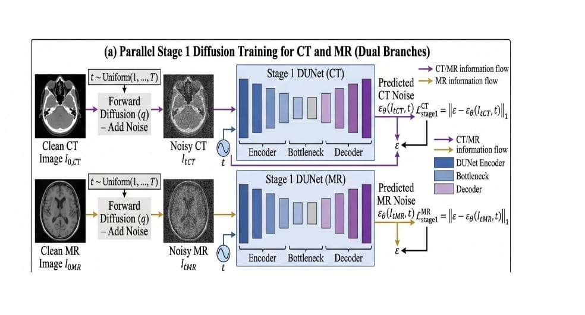
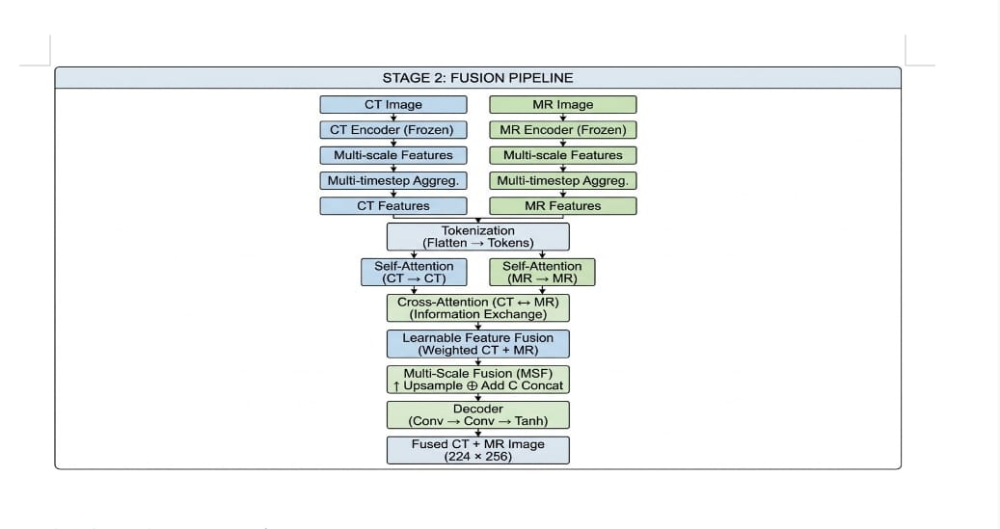
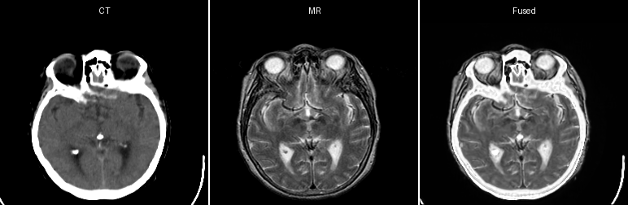

# Diffusion-Transformer-Medical-Image-Fusion

A lightweight and effective deep learning framework for **medical image fusion**, combining **diffusion models** and **transformer-based cross-modal attention** to generate high-quality fused CT-MR images.

---

## 🚀 Motivation & Real-World Impact

Medical imaging often requires analyzing multiple modalities:
- **CT (Computed Tomography)** → captures bone structure
- **MRI (Magnetic Resonance Imaging)** → captures soft tissues

Doctors must manually compare both, which is time-consuming, cognitively demanding, and prone to missed details.

### 🎯 Why Fusion?

Image fusion creates a **single image containing both CT and MR information**, enabling:
✅ Better diagnosis  
✅ Improved tumor localization  
✅ Reduced analysis time  
✅ Enhanced clinical decision-making  

---

## ❗ Problem with Existing Methods

Traditional and deep learning methods suffer from:
- ❌ Loss of structural details  
- ❌ Blurred edges  
- ❌ Poor cross-modal understanding  
- ❌ Heavy models (not practical in hospitals)  

---

## 💡 Our Solution

**DiffTransFuse** introduces:
- **Diffusion-based Feature Learning (Stage 1)**: Learns robust representations using noisy inputs.
- **Transformer-based Fusion (Stage 2)**: Uses **cross-attention** for intelligent fusion.
- **Lightweight Design**: Efficient and deployable in real-world clinical systems.

---

## 🧠 Architecture Overview

### 📌 Stage 1: Diffusion Feature Learning



*Figure: The diffusion process extracting multi-scale feature representations from CT and MR images.*

- Adds noise to CT and MR images
- Uses **Diffusion UNet**
- Learns multi-scale feature representations
- Outputs feature maps at multiple timesteps

### 📌 Stage 2: Transformer Fusion Pipeline



*Figure: The Transformer-based fusion head employing cross-modal attention mechanisms to intelligently merge features and synthesize the final image.*

---

## 🧪 Sample Results



*The collage above clearly demonstrates the successful integration of dense bone structures from CT scans alongside the intricate soft tissue details from MRI, achieving high structural fidelity without blurring or artifacts.*

---

## 📊 Advantages

- ✔ Preserves edges and textures  
- ✔ Maintains structural integrity  
- ✔ Intelligent modality interaction  
- ✔ Lightweight & fast  
- ✔ High-quality fusion output  

---

## 📁 Project Structure

```text
Diffusion-Transformer-Medical-Image-Fusion/
 ├── assets/
 ├── models/
 ├── data/
 ├── train_stage1.py
 ├── train_stage2.py
 └── README.md
```

---

## 📥 Dataset

We use the Harvard CT-MR dataset:
👉 Download here: https://zenodo.org/records/7260705

### 📌 Setup

1. Download dataset  
2. Extract into `DiffTransFuse/DATASET/`

---

## ⚙️ Installation

```bash
git clone https://github.com/Prudhvisunku14/Diffusion-Transformer-Medical-Image-Fusion.git
cd Diffusion-Transformer-Medical-Image-Fusion
pip install -r requirements.txt
```

---

## 🏋️ Training

### 🔹 Stage 1 (Train Encoders)
Train the CT and MR diffusion models:
```bash
python train_stage1.py --modality both
```

### 🔹 Stage 2 (Train Fusion Head)
Train the cross-modal fusion network:
```bash
python train_stage2.py
```

---

## 🔍 Inference

### Patient-wise dataset structure:
```bash
python test.py
```

### Flat CT/MR folder structure:
```bash
python fuse_user_data.py
```

---

## 📈 Evaluation

Compute metrics like SSIM, PSNR, VIF, SCD, MS-SSIM, etc.
```bash
python test.py --compute-metrics
```
Or for existing outputs:
```bash
python evaluation_metrics.py
```

---

## 🧠 Key Idea

> Instead of directly fusing images, we first learn **robust representations using diffusion**, then fuse them using **cross-modal attention**.

---

## 🔮 Future Work

- Extend to PET/SPECT fusion
- Real-time deployment in hospitals
- Integration with diagnostic AI systems

---

## 👨‍⚕️ Clinical Impact

This system helps doctors by:
- Reducing interpretation time
- Providing clearer visual information
- Improving diagnostic accuracy

---

## 🌟 Novelty

A novel, lightweight framework that uses **diffusion models** not for generation, but as multi-timestep, noise-robust feature extractors. These features are then intelligently merged using **transformer-based cross-modal attention**, achieving superior structural fidelity without the heavy computational cost of traditional diffusion pipelines.
